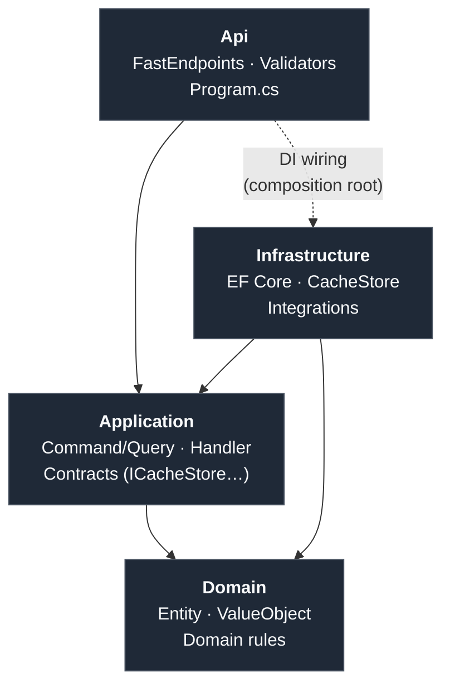

# MachTen

[](https://github.com/guvenimat/MachTen/actions/workflows/ci.yml)
[](LICENSE)
[](https://dotnet.microsoft.com/)

Ücretsiz ve açık kaynak kütüphanelerden oluşan, performans odaklı bir **.NET 10 API starter template**'i. Amaç, hazır ödeme gerektirmeyen (Redis yerine Garnet gibi) en hızlı araçları Clean Architecture + Vertical Slice yapısında bir araya getirip yeni servisler için başlangıç noktası oluşturmak.

## Template olarak kullanım

Bu repo `dotnet new` template'i olarak kurulabilir — proje/namespace isimleri otomatik değişir:

```bash
git clone https://github.com/guvenimat/MachTen.git
dotnet new install ./MachTen
dotnet new machten -n BenimProjem
```

Sonuç: `BenimProjem.sln`, `src/BenimProjem.Api`, `BenimProjemDbContext` … tüm isimler yeniden yazılır, çözüm doğrudan derlenir.

## Mimari

Katmanlı (Clean Architecture) + özellik bazlı (vertical slice) hibrit yapı. Bağımlılıklar daima içe doğru akar — `Domain` hiçbir şeye bağımlı değildir:



`Infrastructure`, `Application`'daki arayüzleri implemente eder (dependency inversion); `Api` yalnızca composition root olarak ikisini birbirine bağlar.

```
src/
  MACHTEN.Domain          → Entity, value object, domain exception (framework'ten bağımsız)
  MACHTEN.Application     → Use case'ler (Command/Query + Handler), DTO, arayüzler (Contracts)
  MACHTEN.Infrastructure  → Arayüzlerin implementasyonu: EF Core, cache, harici entegrasyonlar
  MACHTEN.Api             → FastEndpoints endpoint'leri (Features/ altında), composition root (Program.cs)
tests/
  MACHTEN.Domain.Tests           → Domain birim testleri
  MACHTEN.Application.Tests      → Handler/validator birim testleri
  MACHTEN.Api.IntegrationTests   → Testcontainers (gerçek SQL Server + Redis) ile uçtan uca endpoint testleri
```

Yeni bir özellik eklerken 4 katmanda da `Features/<ÖzellikAdı>/` altına ilgili dosyaları ekleyin — basit örnek için `Features/Ping`, validasyonlu örnek için `Features/Echo`'ya bakın. Detaylar için [CONTRIBUTING.md](CONTRIBUTING.md).

## Kullanılan kütüphaneler ve neden

| Amaç | Kütüphane | Neden |
|---|---|---|
| HTTP endpoint'leri | [FastEndpoints](https://fast-endpoints.com/) | Controller/MVC'ye göre çok daha düşük overhead, REPR pattern |
| İstek validasyonu | FluentValidation (FastEndpoints entegrasyonu) | Endpoint'e otomatik bağlanan, test edilebilir validator'lar |
| Mediator / mesajlaşma | [WolverineFx](https://wolverinefx.net/) | Kaynak üretimli (source-gen), MediatR'dan belirgin şekilde hızlı |
| Veritabanı | EF Core + SQL Server | Endüstri standardı, connection pooling (`AddDbContextPool`) ile optimize |
| Cache (L1+L2) | `Microsoft.Extensions.Caching.Hybrid` + [Garnet](https://microsoft.github.io/garnet/) | Garnet, Redis protokolüyle uyumlu, MIT lisanslı, Redis'ten daha yüksek throughput'lu ücretsiz alternatif |
| Observability | OpenTelemetry → Prometheus + Grafana | Tamamen ücretsiz, açık standart, vendor lock-in yok |
| Health checks | AspNetCore.HealthChecks (SqlServer, Redis) | `/health` endpoint'i üzerinden bağımlılık durumu |
| Mesajlaşma altyapısı | Kafka | Event-driven senaryolar için hazır altyapı (henüz koda entegre değil) |
| Hızlı JSON | `System.Text.Json` source-generator (`SerializerContext.cs`) | Reflection'sız serileştirme, `PublishReadyToRun` + `TieredPGO` ile birlikte daha hızlı soğuk başlangıç |
| Test | xUnit + Testcontainers | Ücretsiz, gerçek bağımlılıklara (SQL Server/Redis) karşı izole ve tekrarlanabilir testler |
| CI | GitHub Actions | Build + test + Docker image doğrulaması her push/PR'da otomatik çalışır |

## Hızlı başlangıç

```bash
cp .env.example .env   # şifreleri kendi değerlerinizle değiştirin
docker compose up --build
```

- API: http://localhost:5000/api/v1/ping
- Swagger: http://localhost:5000/swagger
- Health check: http://localhost:5000/health
- Prometheus: http://localhost:9090
- Grafana: http://localhost:3000 (admin / `.env`'deki `GRAFANA_ADMIN_PASSWORD`)

`.env` dosyası git'e dahil değildir (`.gitignore`'da); gerçek şifreleri asla commit etmeyin.

## Yerelde çalıştırma (Docker olmadan)

SQL Server ve Garnet/Redis'in ayrıca ayakta olması gerekir (örn. `docker compose up sqlserver garnet`).

```bash
dotnet run --project src/MACHTEN.Api
```

## Veritabanı migration'ları

```bash
dotnet tool install --global dotnet-ef
dotnet ef migrations add <MigrationAdi> --project src/MACHTEN.Infrastructure --startup-project src/MACHTEN.Api --context MachtenDbContext -o Persistence/Migrations
dotnet ef database update --project src/MACHTEN.Infrastructure --startup-project src/MACHTEN.Api
```

`InitialCreate` migration'ı zaten mevcut (henüz entity olmadığı için boş) — yeni bir entity eklediğinizde bu deseni izleyin.

## Test

```bash
dotnet test tests/MACHTEN.Domain.Tests           # hızlı, izole
dotnet test tests/MACHTEN.Application.Tests      # hızlı, izole
dotnet test tests/MACHTEN.Api.IntegrationTests   # Docker gerektirir (Testcontainers)
```

## API versiyonlama

FastEndpoints'in yerleşik versiyonlama desteği kullanılıyor. Yeni bir endpoint eklerken `Configure()` içinde `Version(1)` çağırın; route otomatik olarak `api/v{version}/...` şeklinde oluşur.

## Notlar / bilinen kısıtlar

- **Native AOT (`PublishAot`) kasıtlı olarak kapalı.** FastEndpoints'in endpoint keşfi reflection tabanlı çalışıyor; ILC trimmer, yalnızca reflection ile erişilen endpoint sınıflarını "ölü kod" sayıp siliyor ve `FastEndpoints was unable to find any endpoint declarations!` hatasıyla açılışta çöküyor (Docker'da doğrulandı). Bunun yerine `PublishReadyToRun` + `TieredPGO` ile JIT altında hızlı soğuk başlangıç hedeflendi. FastEndpoints ileride tam AOT desteği eklerse tekrar denenebilir.
- `WolverineFx` için major sürüm güncellemesi mevcut (6.x); bu template kasıtlı olarak test edilmiş 5.16.2 sürümünde sabit tutuldu. Yükseltmeden önce breaking change notlarını kontrol edin.
- Kafka altyapısı `docker-compose.yml`'de tanımlı ama henüz üretici/tüketici kodu yazılmadı — event-driven bir feature eklerken referans olarak kullanılabilir.
- `/health` endpoint'i SQL Server'ı `master` veritabanı üzerinden kontrol eder; uygulama veritabanı (`MachtenDb`) henüz migration çalıştırılmadıysa oluşmamış olabilir, bu health check'i etkilemez.

## Lisans / tedarik notları

Son 2-3 yılda birçok popüler .NET paketi (MediatR, AutoMapper, FluentAssertions, Redis'in sunucu tarafı vb.) ücretsizden ücretli/kısıtlı lisansa geçti. Bu template'in "tamamen ücretsiz" iddiasını korumak için mevcut seçimler bilinçli yapıldı; yeni bir paket eklerken aşağıdaki listeyi kontrol edin.

**Bu projede kullanılanlar — doğrulandı, hepsi MIT/Apache 2.0, paralı katmanı yok:** FastEndpoints, WolverineFx, FluentValidation, EF Core, `Caching.Hybrid`/`Caching.StackExchangeRedis`, OpenTelemetry, AspNetCore.HealthChecks, NSwag, xUnit, Testcontainers, NSubstitute.

> ⚠️ **FluentValidation ≠ FluentAssertions.** İsimleri benzer ama farklı proje/yazar — FluentValidation hâlâ tamamen ücretsiz (Apache 2.0), FluentAssertions ise v8'den beri ticari lisans gerektiriyor. Bu template FluentAssertions **kullanmıyor**, testlerde ham `xUnit.Assert` tercih edildi.

**Yaygın ama artık ücretli olan paketler ve bu projede tercih edilen ücretsiz karşılıkları:**

| Ücretliye geçen | Bu projede yerine kullanılan / önerilen |
|---|---|
| MediatR (v13+, 2025) | ✅ WolverineFx (zaten kullanılıyor) |
| AutoMapper (2025) | Kullanılmıyor — gerekirse **Mapperly** (MIT, source-gen) |
| FluentAssertions (v8+, 2025) | ✅ Ham `xUnit.Assert` (zaten kullanılıyor); gerekirse **Shouldly** (BSD-2) |
| Moq (2023 güven sorunu) | ✅ NSubstitute (zaten kullanılıyor) |
| Redis sunucusu (RSALv2, 2024) | ✅ Garnet (zaten kullanılıyor) |
| EPPlus (Excel, 2020) | Kullanılmıyor — gerekirse **ClosedXML** (MIT) |
| iText7 (PDF) | Kullanılmıyor — gerekirse **PdfSharp** (MIT); QuestPDF'in Community lisansı da $1M gelir sınırlı, dikkat |
| Duende IdentityServer (2022) | Kullanılmıyor — gerekirse **OpenIddict** (Apache 2.0) |
| MassTransit (v9+, 2024) | ✅ WolverineFx'in dahili Kafka/RabbitMQ transport'u (zaten kullanılıyor) |

## Lisans

[MIT](LICENSE)
